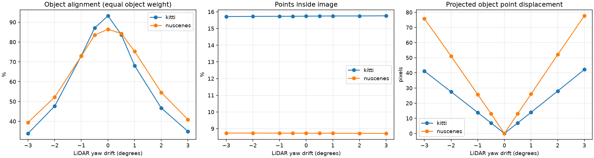
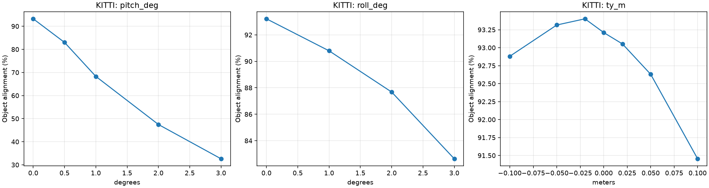
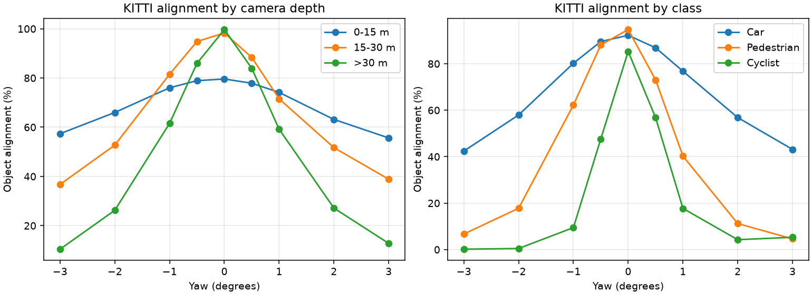
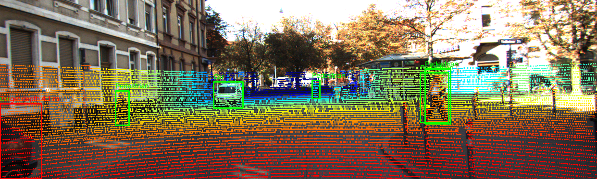
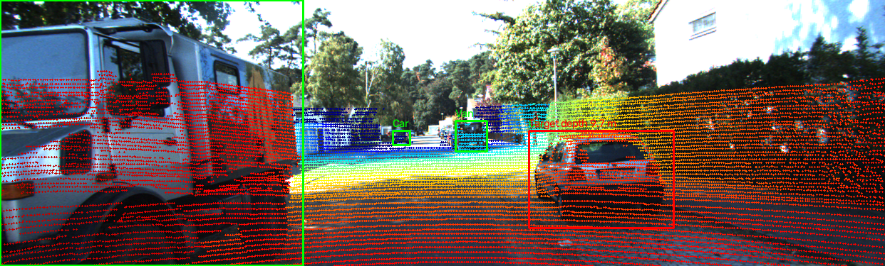
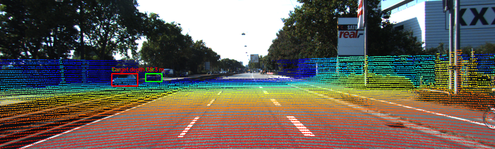
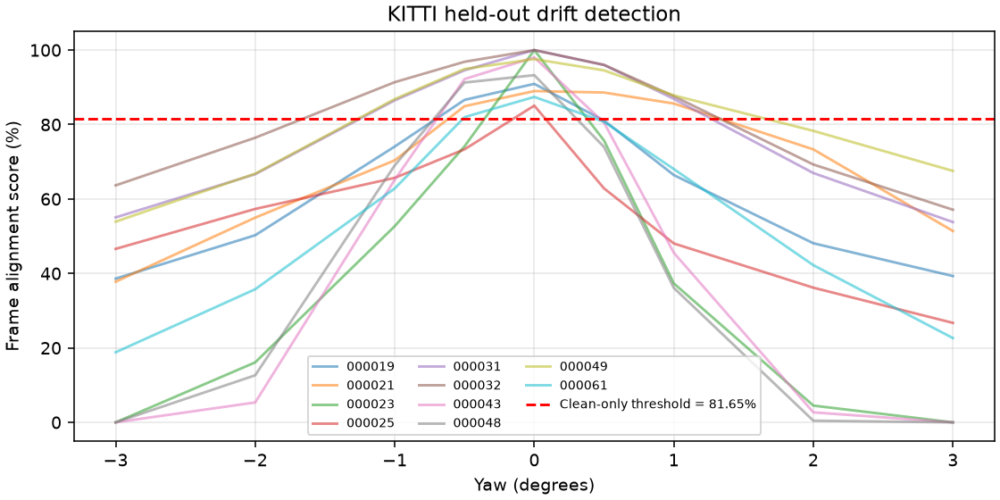
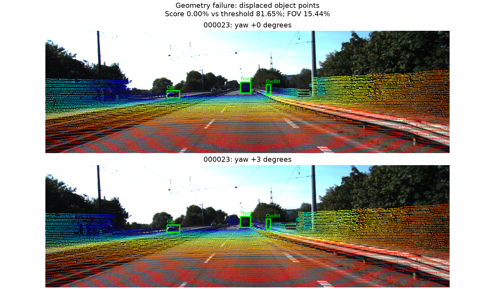
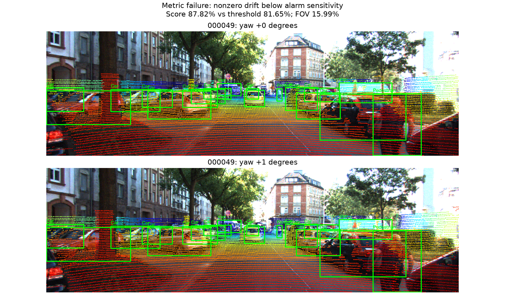

# Báo cáo Day 6: Độ nhạy của LiDAR–camera projection với calibration drift

- **Họ tên:** Trần Ngọc Khuyến
- **MSSV:** 2A202602682
- **Lớp:** AI20K-T4
- **Link repo:** https://github.com/TrKhuyn/TranNgocKhuyen-2A202602682-Track4-Day21
- **Topic:** A — LiDAR-camera projection QA; Good + khảo sát alignment score/ngưỡng ở mức Advanced.
- **Dataset:** data/synthetic (kiểm tra geometry), data/kitti_mini, data/nuscenes_mini_subset.
- **Các frame đã dùng:** KITTI: 000001, 000004, 000007, 000008, 000009, 000010, 000011, 000012, 000015, 000016, 000019, 000021, 000023, 000025, 000031, 000032, 000043, 000048, 000049, 000061; nuScenes: `scene-0103_000…039`, `scene-1094_000…039`; synthetic: 000000 cho kiểm tra điểm chuẩn.
- **Môi trường tạo số liệu hiện tại:** máy Windows local; chưa xác nhận chạy Colab; Python 3.11.9, NumPy 2.4.6, OpenCV 5.0.0, pandas 3.0.6, matplotlib 3.11.2.

## 1. Claim

Trên 20 frame KITTI, lệch yaw +1° làm alignment trung bình theo object giảm từ **93.21% xuống 68.08%** (−25.13 điểm phần trăm), trong khi tỉ lệ điểm trong FOV chỉ đổi từ 15.74% thành 15.75%.
Ở +3°, alignment còn 34.93%; vì vậy FOV ratio một mình không đủ để kiểm tra calibration.
Đây là kết quả thực nghiệm trên subset, không phải ngưỡng bảo đảm an toàn cho mọi sensor hoặc scene.

## 2. Evidence

Mỗi lần chỉ thay đổi một yếu tố: yaw −3…+3° trên hai dataset; pitch 0/0.5/1/2/3°, roll 0/1/2/3°, translation theo y LiDAR KITTI 0/±2/±5/±10 cm. Seed 42, không có phép lấy mẫu ngẫu nhiên trong benchmark.
Tập điểm object được chọn **một lần** bằng box 3D GT và calibration gốc, cố định qua mọi mức drift; mỗi object có ≥5 điểm, kể cả điểm ra khỏi FOV sau perturb vẫn nằm trong mẫu số.
`alignment = 100 × mean_object(n_points_inside_own_2D_box / n_reference_object_points)`; bảng dùng trung bình theo object, score cảnh báo dùng trung bình object trong từng frame. FOV dùng số điểm XYZ hữu hạn làm mẫu số; CSV còn có micro average theo điểm.

| Yaw (°) | KITTI: alignment (%) | KITTI: FOV (%) | nuScenes: alignment (%) |
|---:|---:|---:|---:|
| -3 | 33.87 | 15.72 | 39.40 |
| -2 | 47.61 | 15.73 | 52.19 |
| -1 | 73.05 | 15.73 | 72.85 |
| -0.5 | 87.05 | 15.73 | 83.49 |
| +0 | 93.21 | 15.74 | 86.46 |
| +0.5 | 83.73 | 15.75 | 84.29 |
| +1 | 68.08 | 15.75 | 75.28 |
| +2 | 46.70 | 15.75 | 54.57 |
| +3 | 34.93 | 15.76 | 40.86 |





Demo ở ba độ sâu target khác nhau: `000019`: 9.72 m; `000011`: 4.13 m; `000004`: 38.26 m. Target được đánh dấu đỏ; các box còn lại màu xanh. Màu điểm theo depth của starter: đỏ gần, xanh xa.





**Ngưỡng Advanced:** lấy percentile 5 của score clean trên 10 frame KITTI đầu theo frame ID: **81.65%**; alarm khi score thấp hơn ngưỡng. Không dùng frame evaluation hoặc các mức perturb để chọn ngưỡng.
Trên 10 frame còn lại: alarm +1° = 60%, −1° = 70%, clean = 0%; chi tiết trong `results/detection_summary.csv`. Với tập test nhỏ và các perturb của cùng frame, không xem đây là ước lượng độc lập hay bảo đảm tổng quát.



**[B5]** Cùng yaw sweep trên hai dataset thật: bảng trên và `results/sweep_summary.csv` là bằng chứng. KITTI 64 beam, ảnh hẹp 1242×375; nuScenes 32 beam, ảnh 1600×900 và hai scene ngày/đêm. Khác focal length, FOV, object mix và số điểm tạo ra mức dịch pixel/score khác nhau; không quy toàn bộ khác biệt cho số beam.
nuScenes đã bù ego motion nhưng chưa bù chuyển động riêng từng object. Box 2D của loader nuScenes **được sinh từ box 3D**, nên kết quả này là kiểm tra nhạy với perturb trong cùng hình học, không phải đối chiếu annotation 2D độc lập như KITTI.
Nguồn ảnh: **KITTI Vision Benchmark Suite**; dữ liệu nuScenes: **nuScenes (Motional)**.

CSV tái lập: `results/frame_metrics.csv`, `object_metrics.csv`, `sweep_summary.csv`, `drift_detection.csv`, `detection_summary.csv`, `demo_depths.csv`; cấu hình, phiên bản và SHA-256 nằm trong `results/run_metadata.json`.

## 3. Failure case

**Geometry:** frame `000023` ở yaw +3° còn alignment 0.00% và dịch median 37.98 px. Extrinsic sai làm điểm rơi khỏi object; FOV vẫn 15.44% nên không chỉ nhìn tổng số điểm trong ảnh.



**Metric:** frame `000049`, yaw +1° dịch điểm median 14.67 px nhưng score 87.82% vẫn trên ngưỡng 81.65% → bỏ sót drift. Box 2D cho phép sai số vị trí bên trong box; trung bình qua object còn che mất một object bị lệch. Kiểm tra score từng object, displacement và edge alignment để phát hiện.



Điểm pixel displacement cần calibration tham chiếu, còn containment score cần box GT và tập điểm đã chọn từ calibration gốc. Cả hai là công cụ QA **offline**, chưa phải bộ phát hiện drift tự động khi chạy thật không có GT.
Object <5 điểm bị loại nên chưa đánh giá được vật cực xa/thưa; occlusion/truncation và box GT vốn có sai số cũng có thể làm score clean thấp. Dùng scene độc lập lớn hơn, score theo class/range và edge alignment để kiểm chứng thêm.

## 4. Khuyến nghị nếu triển khai thật

Use-case: QA sau lắp sensor hoặc sau va chạm nhẹ trên xe ADAS; theo dõi drift trước khi sử dụng kết quả camera–LiDAR fusion.
Log invalid ratio, FOV, alignment theo object/class/range, camera–LiDAR time offset và latency; ảnh overlay cần được giữ ở các frame alarm để review.
Containment tính nhanh nhưng bỏ sót dịch trong box lớn; edge alignment hoặc correspondence độc lập tốn thêm xử lý và dễ nhiễu do texture, ban đêm và occlusion.
Không tự hiệu chỉnh calibration chỉ từ threshold trong lab: cần cảnh báo liên tiếp nhiều frame, kiểm tra chuyển động object, scene đa dạng và quy trình xác nhận calibration.

## 5. Cách chạy lại

Từ thư mục gốc repo đã clone, Python ≥3.10:

```bash
pip install -r requirements.txt
python tools/verify_data.py --data-root data/kitti_mini
python tools/verify_data.py --data-root data/nuscenes_mini_subset
python -m unittest src.test_projection -v
python -m src.topic_a
python -m src.write_report
python tools/check_submission.py
```

**[B4]** Tool dùng lại được: `python -m src.topic_a --help` mô tả mọi tham số và giá trị mặc định; `python -m src.topic_a` chạy toàn bộ thí nghiệm, hoặc thêm `--skip-nuscenes --out-dir results/kitti_only` để chạy KITTI riêng. Bằng chứng: `src/topic_a.py` và CSV/ảnh đã tạo. B4/B5 có thể được chấm tối đa +5 điểm nếu tiêu chí liên quan đạt; không khai báo B1/B2/B3/B6.
**Colab extension:** mở `src/topic_a_colab.ipynb` → Select Kernel → Colab → Auto Connect → Run All. Cell cuối tạo `results.zip` và gửi yêu cầu tải qua widget; nếu trình duyệt/VS Code chặn tải tự động, bấm **Tải results.zip**. ZIP chứa `results/` và REPORT của runtime đó; không cần push code trước khi chạy. Xem `src/COLAB.md` để lấy kết quả về máy.
Notebook sẽ ghi runtime thực vào metadata và tạo lại REPORT từ CSV của runtime đó; không gọi kết quả local là kết quả Colab.
Sáu kiểm tra geometry gồm điểm chuẩn (10,0,0), rigid transform + rectification, cột translation của P2, NaN/Inf/depth/FOV, input rỗng và membership box xoay có bottom-center.

## 6. Khai báo sử dụng AI

| Công cụ | Dùng cho việc gì | Cách kiểm chứng |
|---|---|---|
| Codex | Phân tích đề, hỗ trợ viết projection, benchmark, notebook Colab và báo cáo từ CSV | Kiểm tra geometry độc lập; chạy thật trên dữ liệu gốc, xem overlay/failure và đối chiếu bảng với CSV; ghi đúng runtime trong metadata |

Học viên cần tự đọc code, đối chiếu kết quả và giải thích được metric cùng các failure trước khi nộp/vấn đáp.
